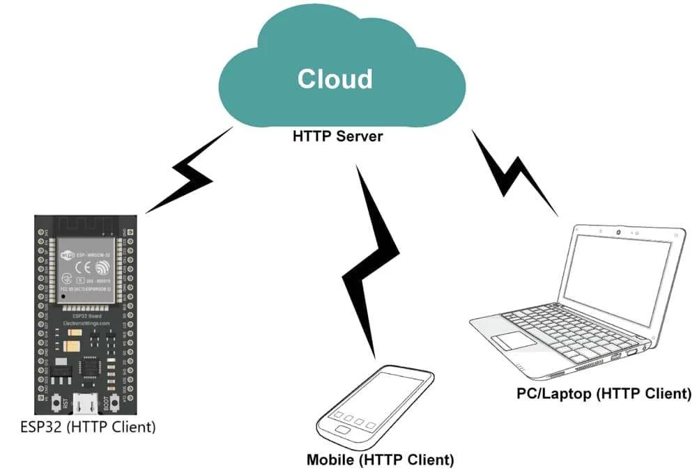
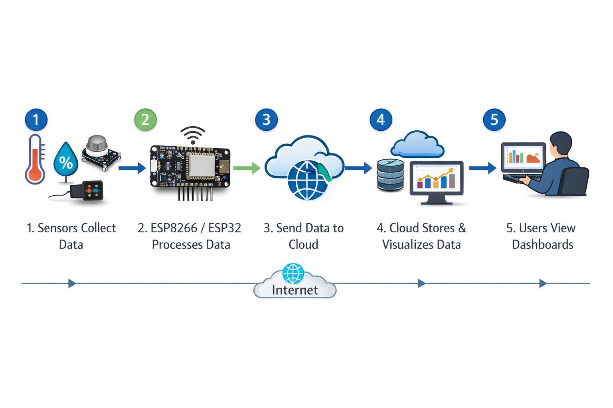
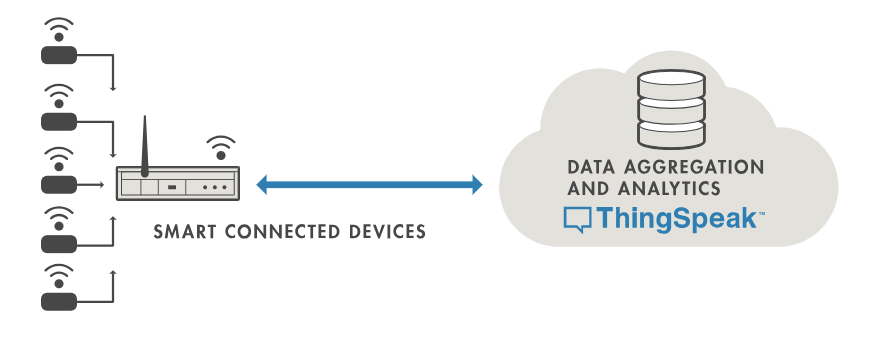

#### Objective

The objective of this experiment is to simulate and understand the **interrelation between IoT cloud platforms and ESP8266 / ESP32 microcontrollers**.

This experiment focuses on **sending sensor data to the cloud**, **real-time dashboard visualization**, and **retrieving stored data using cloud APIs**, with special emphasis on **ThingSpeak** and other commonly used IoT cloud platforms. The experiment enables learners to understand complete **device-to-cloud communication** in IoT systems.

#### Introduction

Cloud platforms play a central role in modern Internet of Things (IoT) ecosystems by enabling remote access, large-scale data storage, visualization, and analytics. Instead of processing and storing data locally, IoT devices transmit sensor data to cloud servers where it can be accessed from anywhere in the world.

Microcontrollers such as **ESP8266 and ESP32**, equipped with built-in Wi-Fi connectivity, act as **edge devices** in IoT systems. These devices collect data from sensors, preprocess it, and transmit it to cloud platforms using standard communication protocols.

This experiment demonstrates how an ESP-based device and a cloud platform work together to form a **complete IoT system**, enabling real-time monitoring, historical data analysis, and remote accessibility.

#### Role of Cloud in IoT Systems

In an IoT architecture, the cloud layer performs multiple critical functions that extend the capability of edge devices.

The major roles of the cloud in IoT systems include:

- Receiving sensor data from multiple IoT devices  
- Storing large volumes of data in cloud databases  
- Providing real-time dashboards for visualization  
- Exposing APIs for data access and integration  
- Enabling remote monitoring and control  
- Supporting analytics, alerts, and automation  

Without cloud integration, IoT systems remain **local, isolated, and limited in scalability**. Cloud platforms enable centralized management and global accessibility of IoT data.

#### ESP8266 / ESP32 as Cloud-Connected IoT Devices

ESP8266 and ESP32 function as **cloud-connected IoT nodes** that bridge the physical world and the digital cloud.

These microcontrollers perform the following tasks:

- Reading sensor data using analog or digital pins  
- Connecting to Wi-Fi networks using stored credentials  
- Formatting sensor data into HTTP or MQTT payloads  
- Sending data to cloud servers  
- Receiving acknowledgments or commands from the cloud  

ESP8266 / ESP32 support multiple communication mechanisms, including:

- **HTTP / HTTPS**  
- **MQTT**  
- **REST APIs**  

This flexibility allows them to integrate with a wide range of cloud platforms and IoT services.

  

#### General Cloud–ESP Communication Architecture

The general communication flow between sensors, ESP devices, and cloud platforms is illustrated below:

1. Sensors collect physical or environmental data  
2. ESP8266 / ESP32 reads and processes sensor values  
3. Processed data is transmitted to the cloud via the internet  
4. Cloud platform stores and visualizes the data  
5. Users access dashboards and analytics remotely  

This architecture separates **data acquisition**, **data transmission**, and **data visualization**, making IoT systems modular and scalable.

  

#### IoT Cloud Platforms Overview

IoT cloud platforms provide ready-to-use services for managing IoT data and devices. These platforms eliminate the need to build custom servers and dashboards from scratch.

Common features of IoT cloud platforms include:

- Secure data ingestion APIs  
- Real-time and historical data visualization  
- Device authentication and management  
- Analytics and alert mechanisms  

Popular IoT cloud platforms include:
- ThingSpeak  
- Firebase  
- Blynk  
- AWS IoT  
- Custom REST-based servers  

#### ThingSpeak Cloud Platform

#### Overview of ThingSpeak

ThingSpeak is a cloud-based IoT analytics platform widely used in **academic laboratories, research projects, and Virtual Labs**. It provides a simple and effective environment for storing, visualizing, and analyzing sensor data.

ThingSpeak allows users to:
- Create data channels  
- Store sensor readings  
- Visualize data using graphs  
- Perform MATLAB-based analytics  

Its simplicity and REST API support make it ideal for educational IoT experiments.

  

#### ThingSpeak Channels and Fields

A **ThingSpeak Channel** represents a data container for sensor values.

Key characteristics:
- Each channel can contain up to **8 data fields**  
- Each field corresponds to a specific sensor  
- Time-stamped data storage  

Example field mapping:
- Field 1 → Temperature  
- Field 2 → Humidity  
- Field 3 → Gas Level  

This structured format allows systematic organization of sensor data.

#### ThingSpeak APIs

ThingSpeak provides **REST-based APIs** that allow interaction between ESP devices and the cloud.

- **Write API Key**  
  Used by ESP8266 / ESP32 to upload sensor data securely  

- **Read API Key**  
  Used by applications or dashboards to retrieve stored data  

Sensor data is typically sent using:
- HTTP GET requests  
- HTTP POST requests  

API-based communication ensures controlled and authenticated data exchange.

#### ThingSpeak Dashboard Visualization

ThingSpeak automatically generates visual dashboards based on received data.

Visualization features include:
- Line graphs  
- Time-based plots  
- Real-time data updates  

These dashboards enable:
- Remote monitoring of sensor data  
- Historical trend analysis  
- Debugging and performance evaluation of IoT systems  

  

#### Data Retrieval and Cloud APIs

In addition to data upload, cloud platforms allow **data retrieval** through APIs.

Using Read APIs, applications can:
- Fetch historical sensor data  
- Integrate data with mobile or web apps  
- Perform external analytics  

This bidirectional interaction establishes a strong interrelation between **cloud platforms and IoT devices**.

#### Applications of Cloud–ESP Integration

Cloud-connected ESP-based IoT systems are widely used in:

- Smart agriculture monitoring  
- Weather stations  
- Smart home automation  
- Industrial IoT systems  
- Healthcare monitoring platforms  

#### Conclusion

This experiment provides a comprehensive understanding of the interrelation between IoT cloud platforms and ESP8266 / ESP32 microcontrollers. By studying cloud-based data storage, visualization, and API-driven interaction, learners gain practical knowledge required to design scalable and remotely accessible IoT systems.

#### References

1. ThingSpeak Official Documentation – https://thingspeak.com/docs  
2. Espressif Systems ESP8266 & ESP32 Documentation  
3. IoT Cloud Computing – IEEE Publications  
4. Internet of Things: A Hands-on Approach – Arshdeep Bahga  
5. RESTful Web Services – O’Reilly  

